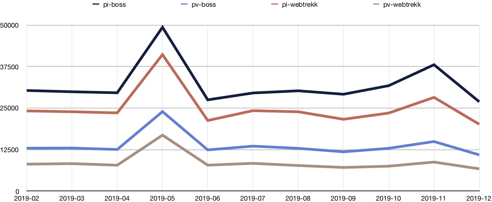

# BOSS vs Webtrekk

Until 2019-12-31, usage statistics were collected with our internal _BerlinOnline Site Statistics_ (BOSS) tool. As of 2020-01-01 we have stopped using BOSS on the Berlin Open Data Portal, and replaced it with [Webtrekk Analytics](https://www.webtrekk.com/de/produkte/analytics/). Webtrekk has been in use side-by-side with BOSS since February 2019. 

While BOSS and Webtrekk provide the same metrics, the actual results differ. 

_Page visits_ is always an approximation, in that the statistics software has some kind of heuristics to determine which _page impressions_ should be considered part of the same visit. The heuristics for BOSS and Webtrekk are slightly different, so unsurprisingly the numbers for page visits differ as well. 

However, the numbers for _page impressions_ also differ, and on average are consistently higher for BOSS compared to Webtrekk. Some reasons that might contribute to this are:

- **Script loading time:** Both BOSS and Webtrekk are loaded via JavaScript in the client, but the BOSS script usually loads faster than the Webtrekk script. In some cases the Webtrekk script will not finish loading before the client requests a new page, meaning that no page impression is recorded.
- **Ad blockers:** it is possible that ad blockers prevent the loading of the tracking scripts. Since Webtrekk is more widely know, it is possible that it is blocked more frequently.
- **Bot detection:** Requests from bots are sometimes recognized by the tracking software and not counted toward the PI total. BOSS and Webtrekk detect different bots, where Webtrekk possibly detects more.

_Page impressions and visits for daten.berlin.de via BOSS and Webtrekk. Raw data is available in [daten_berlin_de.domain.2019.boss-vs-webtrekk.csv](data/comparison/daten_berlin_de.domain.2019.boss-vs-webtrekk.csv)._

For individual datasets, the numbers are not so clear. Sometimes BOSS counts more, sometimes Webtrekk does. The top 10 datasets by page visits for December 2019 are mostly the same for both BOSS and Webtrekk, but the ranking is slightly different.

| Dataset | Ranking BOSS | pv BOSS | Ranking Webtrekk | pv Webtrekk |
| ------- | ------------ | ------- | ---------------- | ----------- |
| vbb-fahrplandaten-gtfs | **1** | 597 | **1** | 570 |
| liste-der-häufigen-vornamen-2018 | **2**  | 322 | **2** | 341 |
| einwohnerinnen-und-einwohner-berlin-lor-planungsräumen-am-31122018 | **3** | 122 | **3** | 150 |
| openstreetmap-daten-für-berlin | **4** | 110 | **4** | 113 |
| _vbb-fahrplandaten-api-0_ | **6** | 93 | **5** | 102 |
| _alkis-berlin-amtliches-liegenschaftskatasterinformationssystem_ | **5** | 96 | **6** | 92 |
| lod2-gebäudedaten-berlin | **7** | 82 | **7** | 77 |
| berlin-um-1900-aisber-wms | **8** | 69 | **8** | 74 |
| _parkraumbewirtschaftung-im-bezirk-friedrichshain-kreuzberg_ | **10** | 58 | **9** | 55 |
| _digitale-farbige-orthophotos-2019-dop20rgb-wms-1_ | **11** | 52 | **10** | 55 |

The raw data for this table is available in [daten_berlin_de.2019-12.boss-vs-webtrekk.csv](data/comparison/daten_berlin_de.2019-12.boss-vs-webtrekk.csv).